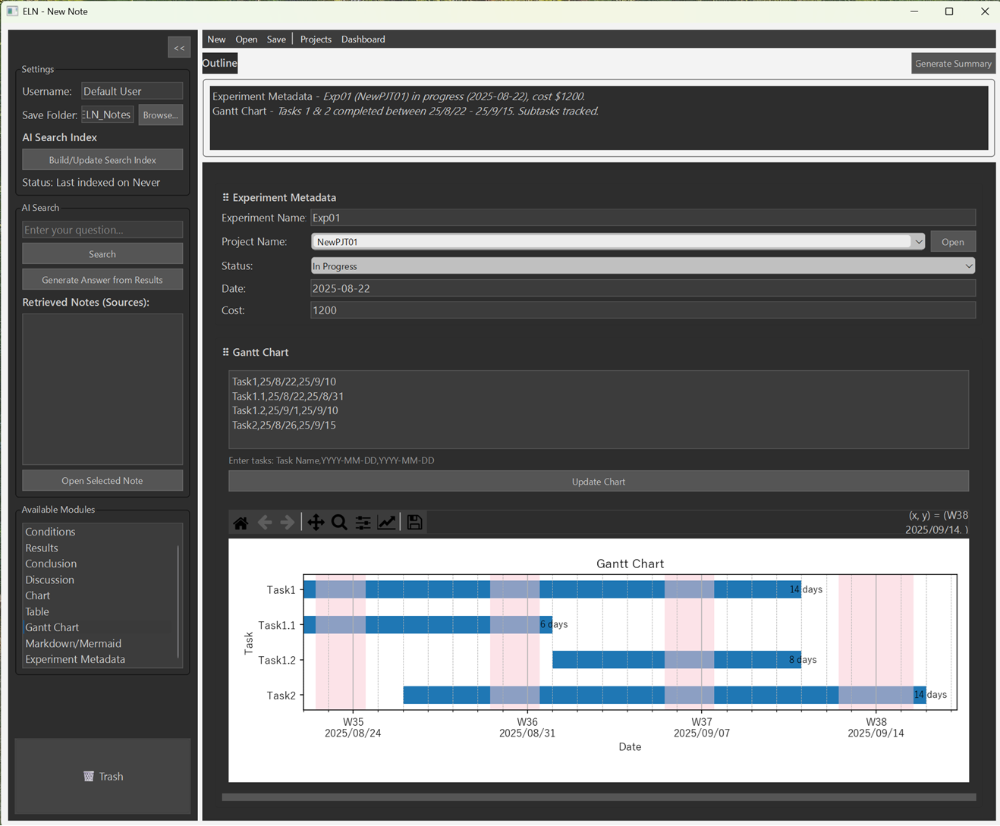

# LabScribe 🧪  

> An AI-native electronic lab notebook (ELN) designed to maximize R&D efficiency with integrated project management and intelligent search.



## Overview 📖  

`LabScribe` is a modern electronic lab notebook (ELN) that is evolving into a Laboratory Information Management System (LIMS). It provides core ELN functionality for recording daily experiments and integrates powerful, locally-run AI features to enhance your workflow.

The application includes **AI-powered summarization**, a full **Project Management** suite with Gantt charts, and a **Retrieval-Augmented Generation (RAG) based AI Search** that allows you to ask natural language questions about your entire knowledge base of notes. All AI features are designed to connect to a local LLM server like Ollama, ensuring your data remains private.

## ✨ Features  

*   **Modular Note Editing:** Add and arrange modules for objectives, conditions, results, discussion, and more.
*   **Project Management:**
    *   Create and manage distinct projects.
    *   Each project has a master Gantt chart for high-level planning.
    *   Notes can be linked to projects as "tickets."
    *   Navigate seamlessly from projects to notes and back.
*   **AI-Powered Summarization:** Automatically generate summaries for each module in your notes with the click of a button.
*   **AI-Powered Search (RAG):**
    *   Build a searchable, semantic index of all your notes.
    *   Ask complex, natural language questions about your experiments (e.g., "What were the results of Project A in the last month?").
    *   Get a direct, synthesized answer generated by an LLM based on the retrieved information.
*   **Rich Content Modules:**
    *   **Gantt Charts:** Visualize project timelines and task dependencies within any note.
    *   **Charts & Tables:** Paste data directly from your clipboard to instantly generate plots and tables.
    *   **Markdown & Mermaid:** Use `Markdown` for text formatting and `Mermaid` syntax for diagrams.
*   **Intuitive UI:** Rearrange modules via drag-and-drop and delete them by dragging to the trash area.

## 🚀 Getting Started  

### 1. Prerequisites  

*   **Python 3.10** or higher.
*   **A local Ollama server.** This is required for all AI features. See the setup guide below.
*   **Node.js** and the Mermaid CLI (only required if you intend to create `Mermaid` diagrams).
    ```sh
    npm install -g @mermaid-js/mermaid-cli
    ```

### 2. Installation & Setup

1.  **Clone the repository:**
    ```sh
    git clone https://github.com/your-username/LabScribe.git
    cd LabScribe
    ```  

2.  **Install Python dependencies:**
    ```sh
    pip install -r requirements.txt
    ```  

### 3. AI Features Setup (Ollama)

This application relies on a local Ollama instance to function.

1.  **Install and run Ollama:** Follow the instructions at [https://ollama.com/](https://ollama.com/).

2.  **Pull the required models:** Open your terminal and run the following commands to download the models used by the application:
    ```sh
    # For summarization and answer generation
    ollama pull gemma3:12b

    # For creating embeddings for the search index
    ollama pull granite-embedding:278m
    ```

3.  **Configure the connection (Optional):**
    The application will connect to `http://localhost:11434` by default. If your Ollama server is at a different address, edit the `OLLAMA_API_URL` in `config.py`. You can also change the model names or RAG chunking parameters in this file.

4.  **Build the Search Index:**
    *   Run the application (`python main.py`).
    *   In the "Settings" panel on the left, click the **"Build/Update Search Index"** button.
    *   This process will read all your notes and create a searchable index. It may take some time. You must run this once before you can use the AI Search. Re-run it whenever you have added or significantly changed your notes.

> **Note:** The search index files (`.labscribe_index.faiss` and `.labscribe_index_meta.json`) are stored in your user home directory. As they start with a dot, they may be hidden on macOS and Linux.

## ✍️ Usage
*   **Adding Modules:** Drag a module from the "Available Modules" list into the central editor.
*   **Project Management:**
    *   Click the "Projects" button in the toolbar to open the Project Browser.
    *   Create new projects or open existing ones to view the master Gantt chart and linked notes.
    *   In a note's "Experiment Metadata" module, select a project from the dropdown to link it. Click the "Open" button to jump directly to that project's view.
*   **AI Search:**
    *   Type your question into the "AI Search" panel and click "Search."
    *   The most relevant notes will appear in the "Retrieved Notes" list. Select a result and click "Open Selected Note" to view it.
    *   After results are retrieved, click "Generate Answer from Results" to get a synthesized answer from the AI.

## 🗺️ Roadmap  

*   [x] Gantt chart integration
*   [x] AI-powered summarization
*   [x] KPI/resource dashboard
*   [x] Project Management View
*   [x] AI-powered search (RAG)
*   [ ] Trusted Timestamping for IP management
*   [ ] Note Version History (Git Integration)
*   [ ] Custom Note Templates
*   [ ] Export to PDF/HTML
